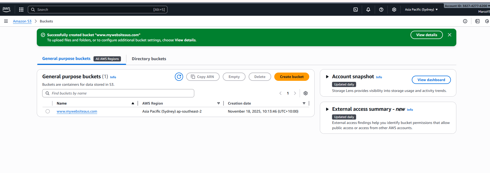
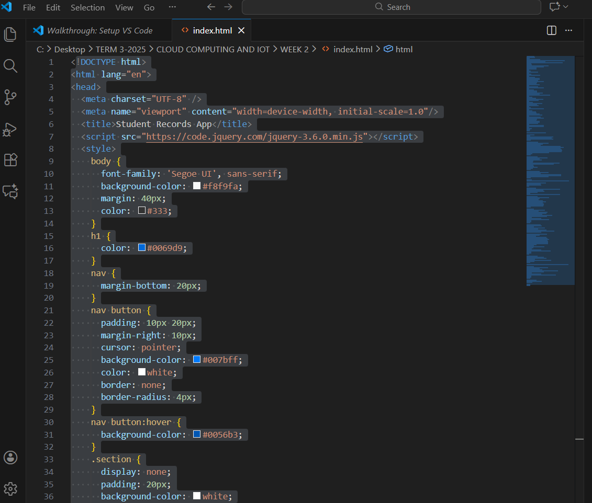
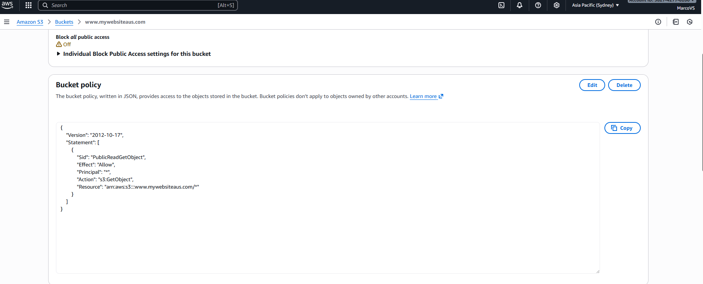
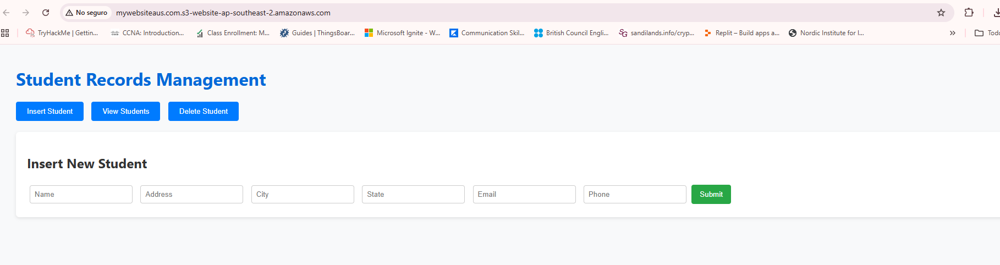

## S3 Bucket – Cloud Security and Compliance

In this activity, I configured an Amazon S3 bucket to host a static web application and applied proper access
control policies. This exercise demonstrates cloud governance, IAM permissions, and compliance validation
in AWS environments.

Learning how a simple misconfiguration can expose sensitive data is essential for GRC specialists to understand: the risk of public access, poor IAM practices, inadequate encryption, and insufficient logging and monitoring. 

### Bucket Creation

### Prepare the Static Web Application

We created a file using Visual Studio Code containing a student registration form, a view student table, a delete student option, and jQuery functions to communicate with a backend EC2 API. The file was uploaded to the bucket. 

### Bucket Policy

A policy was created to allow public read access to the objects inside the bucket, and in this case, the static website can be viewed by anyone.

### Validate the Website

After configuring the bucket, the final step is to verify that everything works correctly. By opening the S3 website, the page loaded correctly.  

