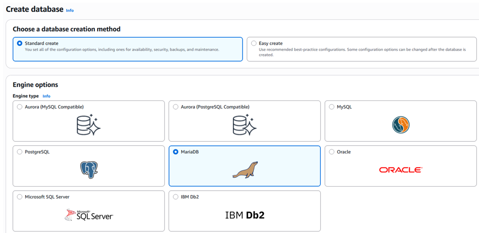

# AWS | Practice

## S3 Bucket – Cloud Security and Compliance

In this activity, I configured an Amazon S3 bucket to host a static web application and applied proper access
control policies. This exercise demonstrates cloud governance, IAM permissions, and compliance validation
in AWS environments.

Learning how a simple misconfiguration can expose sensitive data is essential for GRC specialists to understand: the risk of public access, poor IAM practices, inadequate encryption, and insufficient logging and monitoring. 

### Bucket Creation

### Prepare the Static Web Application

We created a file using Visual Studio Code containing a student registration form, a view student table, a delete student option, and jQuery functions to communicate with a backend EC2 API. The file was uploaded to the bucket. 

### Bucket Policy

A policy was created to allow public read access to the objects inside the bucket, and in this case, the static website can be viewed by anyone.

### Validate the Website

After configuring the bucket, the final step is to verify that everything works correctly. By opening the S3 website, the page loaded correctly.  

## Creating a DB Instance on AWS (RDS)

Set up a managed relational database on AWS using Amazon RDS (MariaDB, free tier) and securely connect it to an existing EC2 instance, with enhanced monitoring enabled and public access disabled. This mirrors a common real-world pattern: an app server (EC2) in a private VPC subnet connecting to a managed database (RDS). 

### Step-by-step (technical view)

1. Log in to the AWS Management Console and open RDS.
2. Click Create database → choose Standard create.
3. Select:
- Engine type: MariaDB
- Template: Free tier
4. Configure DB instance settings:
- Set a unique DB identifier (unique per account & region).
- Choose self-managed credentials and set a strong master password.

5. Under Connectivity:
- For Compute resource, choose Connect to an EC2 compute resource and select the existing EC2 instance ID.

- Set Public access = No, so the DB is only reachable from inside the VPC.

6. Under Monitoring:
- Tick: Enable enhanced monitoring.
- Select log types to export.

7. Click Create database and wait until the status becomes Available.
8. Open the DB in the Databases list → click the DB identifier to see details.
9. In Actions, select Set up EC2 connection (if not already set), choose the EC2 instance, and click Continue → Set up.
10. Record the RDS endpoint (hostname) that EC2 and applications will use to connect.

### News & Real Breaches Related to This Activity

When deploying a Relational Database Service (RDS) on Amazon connected to an EC2 instance in a private VPC, it is crucial to consider configurations such as disabling public access, restricting connectivity, and enabling enhanced monitoring and logging. These controls are fundamental for any secure cloud database.

From a GRC perspective, this configuration reinforces key practices: proper cloud configurations; strong credential governance; and continuous monitoring and auditing.

These controls are essential, especially considering real-world incidents such as:

a) Ransomware targeting AWS databases (2023-2024). Several ransomware groups attacked MongoDB, MySQL, and PostgreSQL databases hosted on AWS that were exposed to the internet without proper authentication. The attackers accessed open ports (3306/5432), deleted or encrypted tables, and demanded a ransom to restore the data. https://lnkd.in/gE53iggs 

b) Third-party breaches caused by misconfiguration of RDS (2024-2025). Several Australian and European companies reported breaches after vendors misconfigured Amazon RDS instances, leaving endpoints publicly accessible or shared snapshots set to "public," thus exposing customer and operational data. Poor GRC oversight, a lack of third-party controls (ISO 27001 A.5.19), and unreviewed manual configurations were observed. Mitiga report: https://lnkd.in/gRWUY3BF

In production, I would extend this with AWS Config, Security Hub, encryption, and IAM with least privilege to prevent misconfigurations and strengthen cloud governance.
