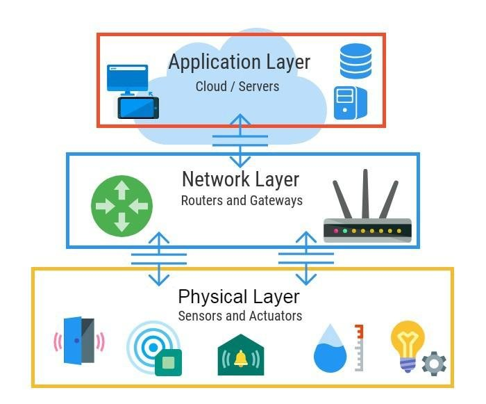
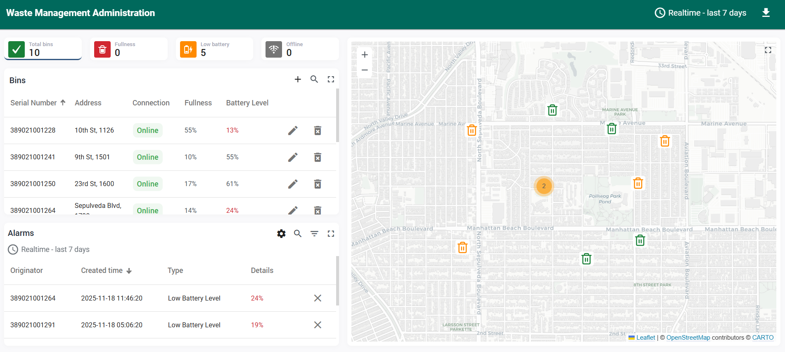
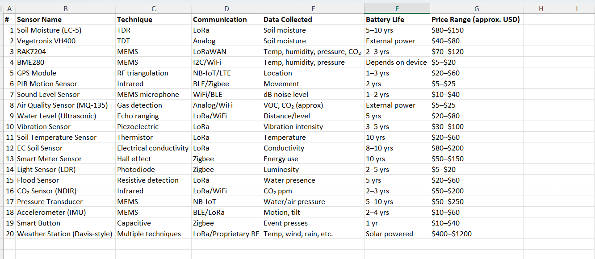

# IoT | Practice

## IoT Layers (3) 

Designing an IoT network requires considering the standards and protocols in three layers: (1) perception; (2) network; and (3) application. 
The perception layer refers to the sensors that capture data from the physical environment. Depending on our project, the data we need will vary, as will the sensors themselves, such as temperature, motion, and humidity.
The network layer is responsible for transporting the data collected by the sensors so that it can be processed in cloud systems, servers, and middleware. Its primary function is to communicate and transmit data securely. La comunicación de los datos puede ser por tecnologías como Bluetooth, WiFi, optical fibres, LTE, y protocolos como IEEE 802.15.4., 6LoWPAN, Zigbee, Z-Wave, CoAP, MQTT, XMPP, DDS)
The application layer is the one that interacts with the end user once the data has been processed, and it is where IoT technology is applied, for example, to homes, agriculture, health, and smart cities.

Narrative: Malik, Anwar and Saad (2021) illustrate a three-layer IoT architecture… 

## IoT Layers (5) 

There is a new IoT layer classification that adds two more layers:

- Middleware layer: related to service management, receiving he information from the network layer, processing information, and performing computation processes linked to databases.
- Business layer: managing the overall IoT system by determining the release of and charging for various IoT applications, also building the business model. 

## IoT Protocols and Standards

IEEE 802.15.4
ZigBee,
Sigfox,
ONE-NET,
WirelessHART,
ISA100.11a,
LoRaWAN,
Bluetooth Low Energy (BLE),
DASH7 etc.

However, the standards can be classified according to the range of the IoT application: 
- For short-range applications, usually the IEEE 802.15-4 protocol is preferred, which is related to low-power and wide-area network (LPWANs). It has a range of 100 metres and operates in frequency bands such as 433 MHz, 915 MHz, and 2.4 GHz. 
- For medium-range application (5.9GHz power of 1W), the IEEE 802.11 standard is preferred.
- For long-range communication (3G, 4G, 5G ), the standard preferred is IoT IEEE 802.11ah, and LoRa/LoRaWAN are the most reliable.
  
## Thingsboard

ThingsBoard is an open-source IoT platform that enables device management, data collection, processing, visualisation, and automation. It supports scalable IoT deployments using features such as dashboards, a rule engine, telemetry storage, alarms, and integrations across multiple protocols like MQTT, CoAP, and HTTP, making it suitable for smart home, industrial IoT, and smart city solutions.
We can analyse some IoT use cases, such as waste management solutions https://thingsboard.io/use-cases/waste-management/ 

## Perception layer. Sensors selection

When selecting sensors for the perception layer, it's essential to consider what data we'll need for our project in order to choose the appropriate sensor. It's also essential to identify the device's deployment location, as this will significantly influence the criteria regarding short-, medium-, and long-range standards, communication protocols, and costs. This will allow us to select the devices that best suit the project, both technically and economically.

## References: 

- Malik, H., Anwar, S., & Saad, A. (2021). The architecture of IoT Layers (3.0) [Figure]. In: A Review of Applications and Communication Technologies for IoT and UAV based Sustainable Smart Farming. Available at: https://www.researchgate.net/figure/The-architecture-of-IoT-Layers-30_fig1_352181755
 (Accessed 18 November 2025).
